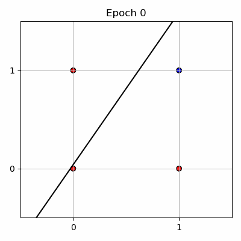
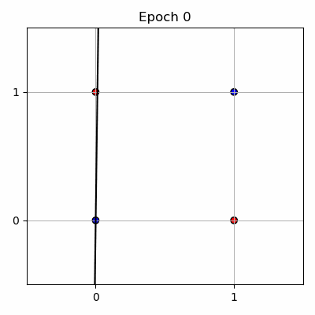

# Perceptron from Scratch

## What is a Perceptron?

A Perceptron is the simplest type of artificial neuron and a fundamental unit in neural networks. It models a binary classifier that decides whether an input belongs to one class or another.

## Mathematical Definition

Given an input vector:

$$
\mathbf{x} = [x_1, x_2, ..., x_n]
$$

The perceptron computes a weighted sum of the inputs plus a bias term:

$$
z = w_1 x_1 + w_2 x_2 + ... + w_n x_n + b
$$

where:

- $\mathbf{w} = [w_1, w_2, ..., w_n]$ are the weights  
- $b$ is the bias scalar  

The perceptron applies a sigmoid activation function to the weighted sum:

$$
\hat{y} = \frac{1}{1 + e^{-z}}
$$

where $\hat{y}$ is the predicted output (a probability between 0 and 1).

## Training the Perceptron on Logic Gates

This implementation trains the perceptron to perform binary logic gate functions such as AND, OR, NAND, and NOR.

### Decision Boundary Evolution GIFs

As the model trains, the decision boundary evolves — shown below for each gate:

| AND                                                | OR                                                 | NAND                                               | NOR                                                |
|---------------------------------------------------|----------------------------------------------------|----------------------------------------------------|----------------------------------------------------|
|       |         |       |        |

*Note: The black line shows the decision boundary where the perceptron output is 0.5.*

### Training Process Summary

1. Initialize weights and bias to small random values.  
2. For a set number of epochs, iterate over each training example:  
   - Compute the prediction $\hat{y}$ using the sigmoid function.  
   - Calculate the gradient of the loss with respect to weights and bias using the difference $(\hat{y} - y)$.  
   - Update the weights and bias by moving against the gradient scaled by the learning rate.  
3. After each epoch, calculate and print the average loss and accuracy over the entire training set.

The model predicts continuous values (between 0 and 1) using sigmoid activation, and classifies inputs by thresholding predictions at 0.5.

## XOR Problem: A Perceptron Limitation

The XOR function is **not linearly separable**, meaning that no single line can perfectly separate the positive and negative classes. Therefore, a single-layer perceptron **cannot** learn XOR.

Here is the evolution of the decision boundary when training a perceptron on XOR:

You can see the perceptron struggles to form a proper decision boundary, failing to classify XOR inputs correctly.

### Why?

- The XOR problem requires a **non-linear decision boundary**, which a single-layer perceptron cannot model.
- To solve XOR, you need a **multi-layer neural network** (at least one hidden layer) that can learn non-linear representations.

---

## References

- The Perceptron: A Probabilistic Model for Information Storage and Organization in the Brain, Rosenblatt (1958)  
- Neural Networks and Deep Learning, Michael Nielsen (Online Book)
